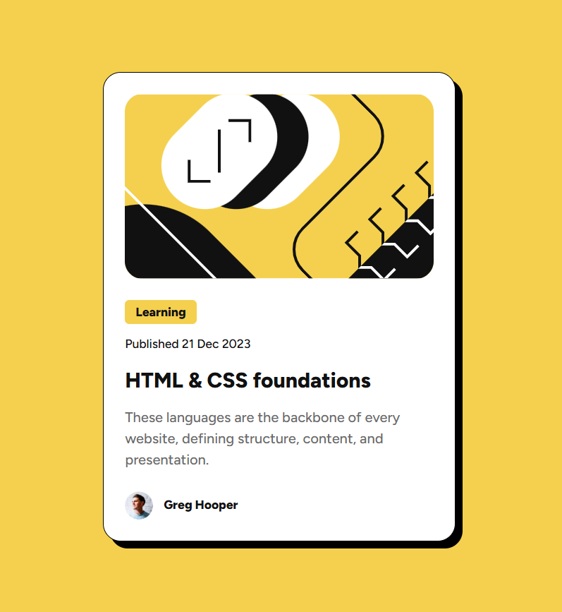

# Frontend Mentor - Blog preview card solution

This is a solution to the [Blog preview card challenge on Frontend Mentor](https://www.frontendmentor.io/challenges/blog-preview-card-ckPaj01IcS). 

## Table of contents

- [Overview](#overview)
  - [The challenge](#the-challenge)
  - [Screenshot](#screenshot)
  - [Links](#links)
- [My process](#my-process)
  - [Built with](#built-with)
  - [What I learned](#what-i-learned)
  - [Continued development](#continued-development)
  - [Useful resources](#useful-resources)
- [Author](#author) 

## Overview

### The challenge

Take the provided design files (Figma) and turn them into a web site users can interact with (hover states).

### Screenshot

 

### Links

- Solution URL: [Github Repository]( https://github.com/carasi-official/FEM-Blog-Preview-Card)
- Live Site URL: [Live on Github Pages]( https://carasi-official.github.io/FEM-Blog-Preview-Card/)

## My process

### Built with

- Semantic HTML5 markup
- CSS variables
- Flexbox
- Vanilla Javascript
- Responsive font

### What I learned

I learned a new CSS function to handle the changing of font sizes for the challenge portion of this project. I had never heard of clamp before today! https://developer.mozilla.org/en-US/docs/Web/CSS/Reference/Values/clamp

I also spent way too long figuring out why the rounded corners wasn’t working on my image. Realized it had nothing to do with the SVG format of the image but rather that I needed to handle the “overflow” of the image. 

### Continued development

I moved the credits section to a sticky footer at the bottom of the page this time, but I want to eventually turn that into a modal or something similar. 

### Useful resources

- [MDN](https://www.example.comhttps://developer.mozilla.org/en-US/) – MDN never fails to save the day

## Author

- Website - [Github]( https://github.com/carasi-official?tab=repositories)
- Frontend Mentor - [@Carasi](https://www.frontendmentor.io/profile/carasi) 
